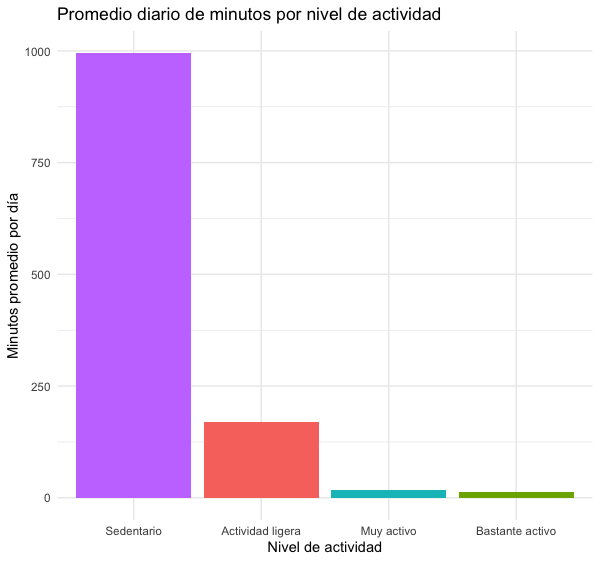
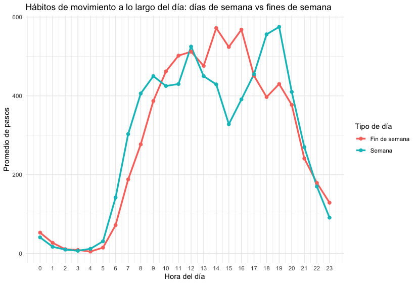
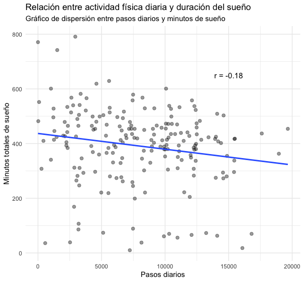

# Fitness Tracking Data Analysis to Inform Bellabeat's Marketing Strategy
### "Marketing with out data is like driving with your eyes closed".
### Dan Zarella
End-to-end data analysis project: data cleaning, transformation, visualization, and business insights.

## Project Highlights

- Performed exploratory analysis of smart device usage data using **SQL (BigQuery)** and **R (tidyverse)**  
- Identified behavioral patterns in daily activity, sedentary time, hourly trends, and sleep duration  
- Found that most users exhibit predominantly light activity levels and structured weekday behavior patterns  
- Generated business-oriented recommendations to support personalization strategies and user engagement initiatives  

This project demonstrates the ability to transform raw data into structured insights aligned with business decision-making.

---

## Business Context

Bellabeat is a wellness technology company focused on smart devices designed to support women's health.

This project analyzes third-party smart device usage data to identify behavioral patterns that could support product strategy and marketing decisions for the Bellabeat Time smartwatch.

---

## Objective

The objective of this analysis is to identify patterns in:

- Daily activity levels  
- Sedentary behavior  
- Hourly activity trends  
- Relationship between physical activity and sleep duration  

The goal is to generate insights that can support business decision-making.

---

## Data Source

**Dataset:** Fitbit Fitness Tracker Data  
**Source:** Kaggle  
**Author:** Mobius  
**Users:** 35  
**Year:** 2016  

This dataset is suitable for exploratory analysis but has limitations related to:

- Sample size  
- Data recency  
- Lack of demographic variables  

---

## Tools Used

- **SQL (BigQuery)** – data cleaning and transformation  
- **R (tidyverse)** – data visualization  
- **Spreadsheets** – initial inspection and validation  

---

## Project Structure

    bellabeat-user-activity-analysis/
    │
    ├── data/
    ├── sql_queries/
    ├── r_scripts/
    ├── images/
    ├── reports/
    └── README.md

---

## Process

1. Data cleaning and validation  
2. Duplicate removal and null checks  
3. Data transformation using SQL  
4. Exploratory data analysis  
5. Data visualization in R  
6. Business-oriented interpretation of results  

---

## Key Findings

### Daily Activity
A significant portion of recorded days are classified as sedentary, although moderate and active levels combined exceed sedentary time.

### Activity Intensity
Most movement corresponds to light activity, with limited time spent in intense physical activity.

### Temporal Patterns
Users show structured activity patterns during weekdays and more flexible behavior on weekends.

### Activity and Sleep
No strong correlation was found between daily steps and sleep duration, suggesting that sleep behavior depends on multiple factors.

---

## Business Insights

- Personalize notifications based on activity level  
- Adapt reminders according to the day of the week  
- Promote sustainable habits rather than high-performance goals  
- Integrate activity and sleep monitoring into a holistic wellness approach  

---

## Limitations

- Small sample size (35 users)  
- Historical dataset (2016)  
- Limited behavioral and demographic variables  

Conclusions should be interpreted as directional insights rather than definitive evidence.

---

## Key Visualizations

All figures were generated using reproducible R scripts located in `r_scripts/`.

### Daily Activity Distribution

### Activity Intensity Distribution

### Hourly Activity Patterns

### Activity vs Sleep

## How to Reproduce the Analysis

1. Run the SQL queries located in `sql_queries/`  
2. Export the resulting datasets to `data/`  
3. Run the R scripts located in `r_scripts/`  
4. Figures will be automatically saved in `images/`  

Make sure working directory is set to the project root before running scripts.

---

## Report

Full analysis and business recommendations available in:

`reports/bellabeat_report_es.pdf`

---

## Author

**Andrés Mauricio Ruiz Anturi**  
Finance Specialist & Data Analyst 

**Skills demonstrated:**

- SQL data transformation  
- Exploratory Data Analysis  
- Data visualization in R  
- Business insight generation  
- Reproducible project structuring

